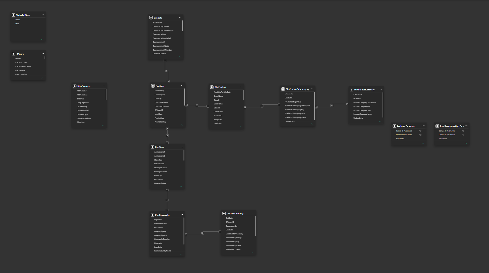

# Data Model

## Data Source

Microsoft Contoso Retail Data Warehouse (ContosoRetailDW)

---

## Fact Table

### FactSales

Contains transactional sales information including:

- Sales Amount
- Sales Quantity
- Discount Amount
- Return Amount
- Total Cost

---

## Dimensions

### DimDate

Date dimension used for:

- Year
- Fiscal Year
- Month
- Time Intelligence calculations

### DimProduct

Product information.

### DimProductSubcategory

Intermediate product hierarchy.

### DimProductCategory

Top-level product hierarchy.

### DimStore

Store attributes:

- Store Name
- Employee Count
- Selling Area Size
- Open Date

### DimGeography

Geographic information:

- Continent
- Country
- State
- City

### DimSalesTerritory

Sales territories and business regions.

---

## Model Type

Star Schema with FactSales as the central fact table.

## Data Model Diagram

